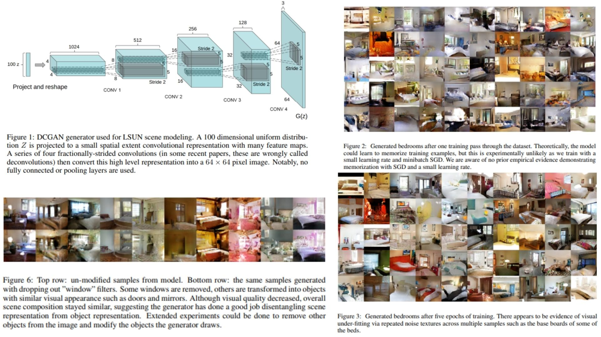

# ✏️ DCGAN-Replication — Deep Convolutional Generative Adversarial Networks

This repository provides a **faithful Python replication** of the **DCGAN framework** for unsupervised representation learning and image generation.  The code implements the pipeline described in the original paper, including **generator and discriminator architectures, strided convolutions, batch normalization, and adversarial training**.

Paper reference: *[Unsupervised Representation Learning with Deep Convolutional Generative Adversarial Networks](https://arxiv.org/abs/1511.06434)*  

---

## Overview 🌟



> The pipeline trains a **generator** $$G$$ to produce realistic images from a **latent vector** $$z$$, while a **discriminator** $$D$$ learns to distinguish **real images** from **generated ones**. Through this adversarial game, both networks improve iteratively, learning a hierarchy of image features.

Key points:

* **Generator (G)**: transforms latent vector $$z \sim \mathcal{N}(0,1)$$ into image space  
* **Discriminator (D)**: classifies input as real (1) or fake (0)  
* **Strided convolutions**: replace pooling layers, allowing **learnable downsampling/upscaling**  
* **Batch normalization**: stabilizes training by normalizing activations  
* **Activations**: ReLU for G (except Tanh in output), LeakyReLU for D  
* **Loss functions**: standard minimax GAN  
- **Discriminator loss**:  
```math
\mathcal{L}_D = - \mathbb{E}_{x \sim p_\text{data}(x)} \big[ \log D(x) \big] 
                 - \mathbb{E}_{z \sim p_z(z)} \big[ \log (1 - D(G(z))) \big]
```
- **Generator loss**:
```math
\mathcal{L}_G = - \mathbb{E}_{z \sim p_z(z)} \big[ \log D(G(z)) \big]
```
---

## Core Math 📐

**Discriminator loss**:

$$
\mathcal{L}_D = \text{BCE}(D(x_\text{real}), 1) + \text{BCE}(D(G(z)), 0)
$$

**Generator loss**:

$$
\mathcal{L}_G = \text{BCE}(D(G(z)), 1)
$$

**Latent sampling**:

$$
z \sim \mathcal{N}(0, I), \quad G: z \mapsto \text{image}
$$

**Adversarial optimization**:

$$
\theta_D \leftarrow \theta_D - \eta \nabla_{\theta_D} \mathcal{L}_D, \quad
\theta_G \leftarrow \theta_G - \eta \nabla_{\theta_G} \mathcal{L}_G
$$

---

## Why DCGAN Matters 🌿

* Learns **unsupervised image representations** useful for downstream tasks 🎯  
* Stable training through **architectural guidelines** (strided conv, batchnorm, ReLU/LeakyReLU)  
* Produces **high-quality generative samples** from simple latent vectors 🖼️  
* Serves as a **foundation** for many advanced GAN variants  

---

## Repository Structure 🏗️

```bash
DCGAN-Replication/
├── src/
│   ├── backbone/
│   │   ├── generator_dcgan.py        # DCGAN Generator (ConvTranspose stack)
│   │   ├── discriminator_dcgan.py   # DCGAN Discriminator (Conv classifier)
│   │   └── blocks.py                # Conv-BN-ReLU / Conv-BN-LeakyReLU
│   │
│   ├── loss/
│   │   └── gan_loss.py              # Minimax GAN losses
│   │
│   ├── model/
│   │   └── dcgan_pipeline.py        # G + D forward & training logic
│   │
│   └── config.py                    # latent_dim, lr, beta1, image_size etc.
│
├── images/
│   └── figmix.jpg                
│
├── requirements.txt
└── README.md
```

---

## 🔗 Feedback

For questions or feedback, contact:  
[barkin.adiguzel@gmail.com](mailto:barkin.adiguzel@gmail.com)
